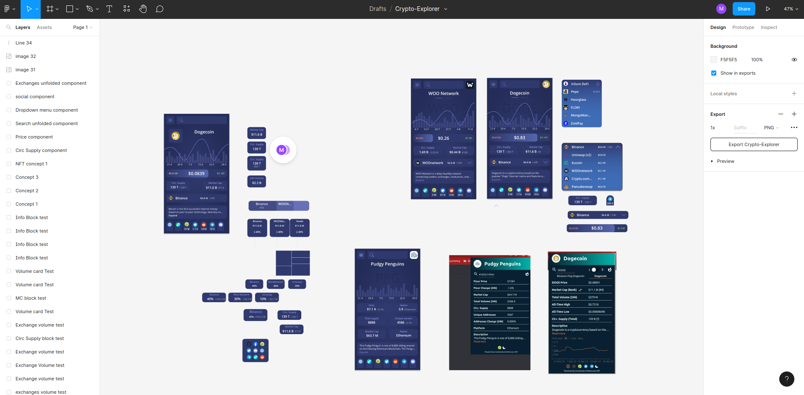
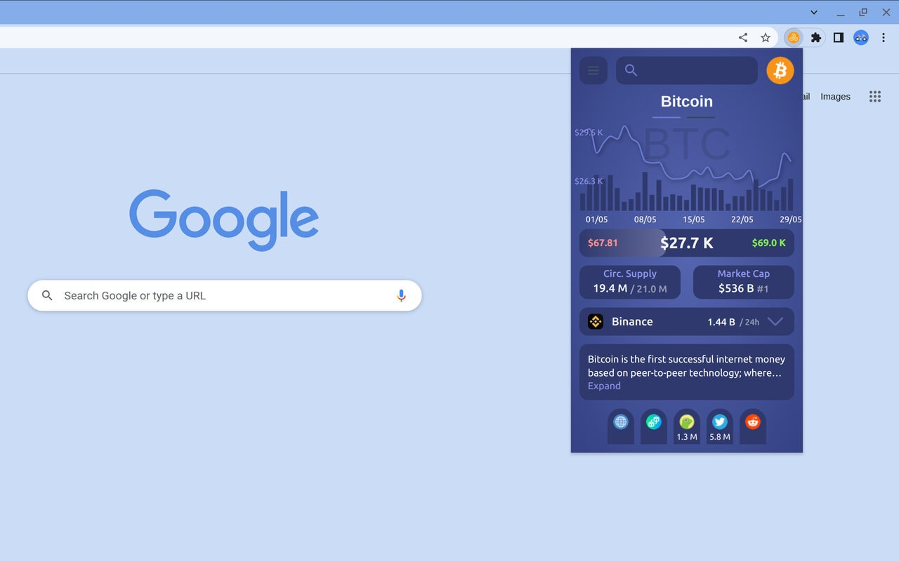
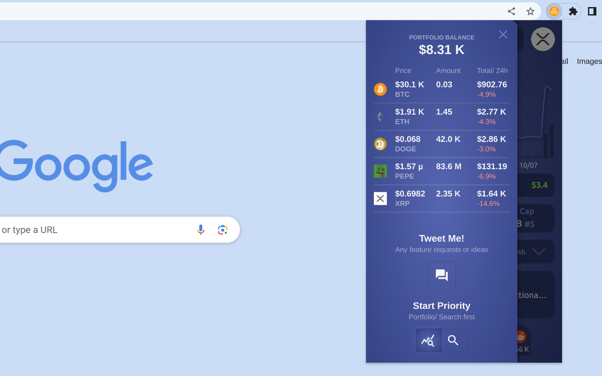
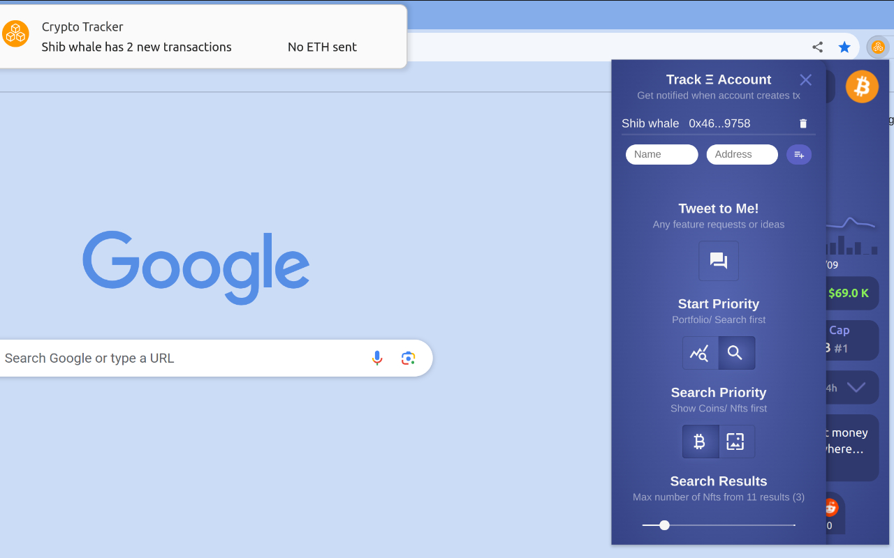
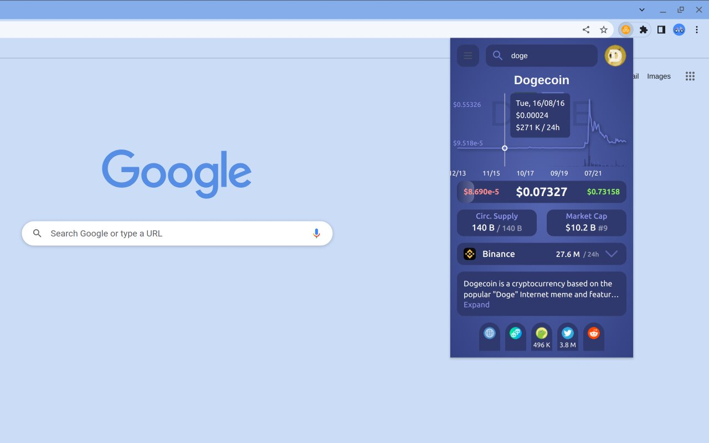
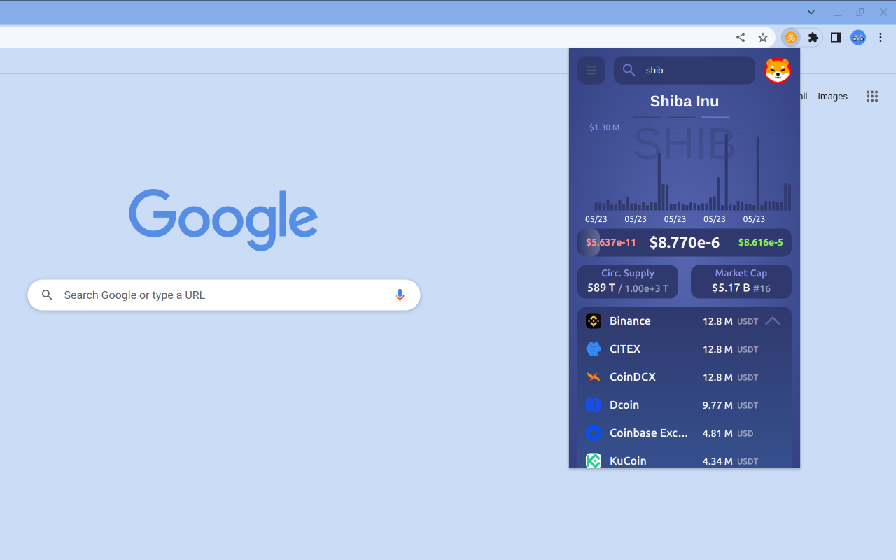
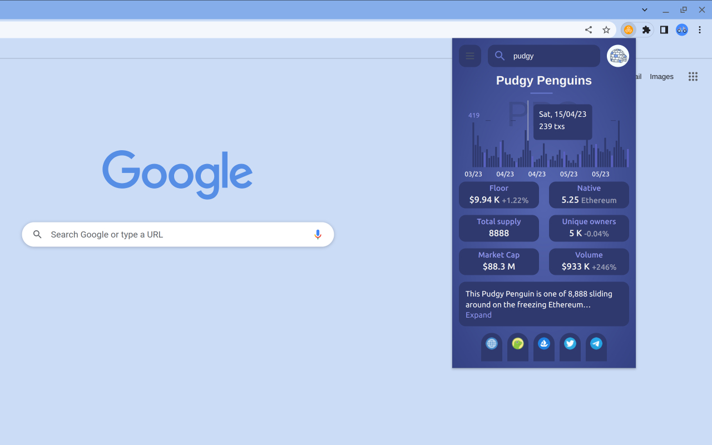
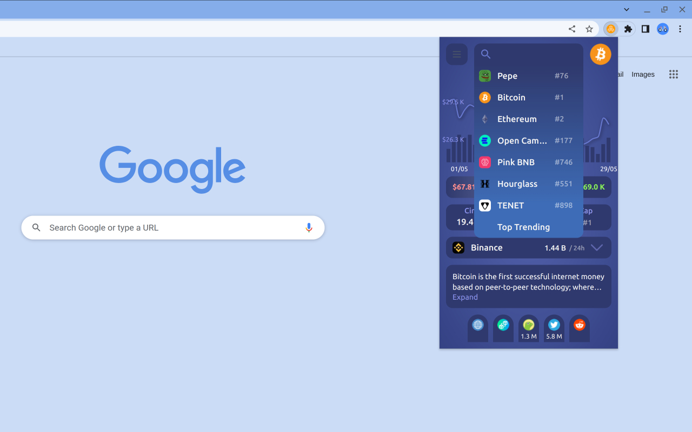

# Crypto portfolio: Blockchain & Crypto tracker

Discover a world of in-depth, real-time (on-chain) information about your favorite cryptocurrencies, NFTs, and whale
accounts with the Crypto and Account Tracker. This easy-to-use tool simplifies cryptocurrency data, giving you key
insights at the tip of your fingers, all from your browser at any page.

### Features

- Hotkeys Integration: Simply press Ctrl+Shift+DownKey (or Command+Shift+DownKey for Mac) to display coin information
  instantly. You can also access the extension via the menu icon.
- Portfolio: Enhance your portfolio by adding coins to track their price performance, or include specific amounts to
  monitor the growth of your portfolio value.
- Account Alerts: Monitor Ethereum accounts of industry leaders, informed investors, and whales. Get hourly updates on
  their recent activities, if any.
- Trending Coins: Keep up-to-date with the market by checking the top trending searched coins.
- Coins and Tokens: Gain access to real-time price and coin-specific data. Leverage our On-chain Whale Finder to track
  the top 50 transactions out of the last 10,000 for any given coin.
- Non-Fungible Tokens (NFTs): Get your hands on general price information and daily on-chain transaction volumes for
  various NFTs.
  Comprehensive Information
- Pick your search priority: Focus on coins or NFTs, and set your startup page.
- Community metrics: Get an understanding of each website's impact and reach with follower sizes.
- Wide On-chain Insights Support: The explorer supports a variety of blockchain networks (9) including Arbitrum,
  Avalanche, Binance Smart Chain, Celo, Cronos, Ethereum, Fantom, Optimism, and Polygon. This ensures you get extensive
  and diverse crypto information, irrespective of the network.
- Easy Navigation: Utilize Arrow and Tab keys to switch between different options and view detailed charts. For even
  easier usability, you can pin the extension icon to your bookmark bar.

- To begin your journey into the crypto world, install the extension and explore crypto like never before!

### General

- a. Press Ctrl+Shift+DownKey/ Command+Shift+DownKey to display ticker information.
- b. Open the extension via the menu icon or hotkeys and search for a coin or NFT.
- Use Arrow and Tab keys to easily switch between options and charts.
- Check the top trending searched coins.

### Coins and Tokens

- Check general price and coin information.
- On-chain Whale Finder: Follow the top 50 transactions of a coin of the last 10000 transactions.

### NFTs

- Check general price and NFT information.
- Check on-chain transaction volumes by day.

### On-chain insights support

- Arbitrum
- Avalanche
- Binance Smart Chain
- Celo
- Cronos
- Ethereum
- Fantom
- Optimism
- Polygon

### Tips

- Pin extension icon at bookmark bar for easier usability.
- Refresh the browser after installation.

[Chrome Store Extension Link](https://chrome.google.com/webstore/detail/crypto-explorer/pkaheoacmbdgnemgmcdbekniooabcnmc)

## Acknowledgements

I would like to thank CoinGecko and Etherscan for providing real-time cryptocurrency data at no cost;

[CoinGecko-API](https://www.coingecko.com/en/api).

[Etherscan-API](https://docs.etherscan.io/).

# Previews

### Figma design

  

### BTC main info

  

### Porfolio info

  

### Account alerts

  

### Doge price chart

  

### Shiba Onchain txs by size; 50 largest of the last 10.000 txs

  

### Pudgy NFT info; nr of txs/day

  

### Trending coins

  

### Settings menu

  

